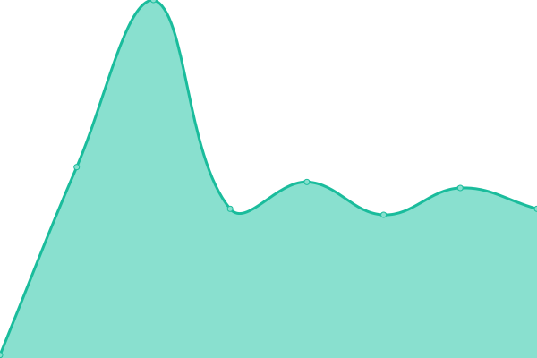

# [📈 Live Status](https://24eme.github.io/upptime): <!--live status--> **🟧 Partial outage**

Monitorisation des sites, services et applications web administrées par le 24ème

<!--start: status pages-->
<!-- This summary is generated by Upptime (https://github.com/upptime/upptime) -->
<!-- Do not edit this manually, your changes will be overwritten -->
<!-- prettier-ignore -->
| URL | Status | History | Response Time | Uptime |
| --- | ------ | ------- | ------------- | ------ |
|  [declaration.vinsalsace.pro](https://declaration.vinsalsace.pro/) | 🟩 Up | [declaration-vinsalsace-pro.yml](https://github.com/24eme/upptime/commits/HEAD/history/declaration-vinsalsace-pro.yml) | 

 1671ms
     
 | 

<a href="https://24eme.github.io/upptime/history/declaration-vinsalsace-pro">100.00%</a>
    

|  [declaration.declarvins.net](https://declaration.declarvins.net/) | 🟩 Up | [declaration-declarvins-net.yml](https://github.com/24eme/upptime/commits/HEAD/history/declaration-declarvins-net.yml) | 

 1584ms
     
 | 

<a href="https://24eme.github.io/upptime/history/declaration-declarvins-net">100.00%</a>
    

|  [declaration.ivbdpro.fr](https://declaration.ivbdpro.fr/) | 🟩 Up | [declaration-ivbdpro-fr.yml](https://github.com/24eme/upptime/commits/HEAD/history/declaration-ivbdpro-fr.yml) | 

 2285ms
     
 | 

<a href="https://24eme.github.io/upptime/history/declaration-ivbdpro-fr">100.00%</a>
    

|  [declaration.ivsopro.com](https://declaration.ivsopro.com/) | 🟩 Up | [declaration-ivsopro-com.yml](https://github.com/24eme/upptime/commits/HEAD/history/declaration-ivsopro-com.yml) | 

 2337ms
     
 | 

<a href="https://24eme.github.io/upptime/history/declaration-ivsopro-com">100.00%</a>
    

|  [declaration.vins-centre-loire.com](https://declaration.vins-centre-loire.com) | 🟩 Up | [declaration-vins-centre-loire-com.yml](https://github.com/24eme/upptime/commits/HEAD/history/declaration-vins-centre-loire-com.yml) | 

 1743ms
     
 | 

<a href="https://24eme.github.io/upptime/history/declaration-vins-centre-loire-com">100.00%</a>
    

|  [declaration.ava-aoc.fr](https://declaration.ava-aoc.fr/) | 🟩 Up | [declaration-ava-aoc-fr.yml](https://github.com/24eme/upptime/commits/HEAD/history/declaration-ava-aoc-fr.yml) | 

 1471ms
     
 | 

<a href="https://24eme.github.io/upptime/history/declaration-ava-aoc-fr">100.00%</a>
    

|  [declaration.syndicat-cotesdurhone.com](https://declaration.syndicat-cotesdurhone.com/) | 🟩 Up | [declaration-syndicat-cotesdurhone-com.yml](https://github.com/24eme/upptime/commits/HEAD/history/declaration-syndicat-cotesdurhone-com.yml) | 

 1417ms
     
 | 

<a href="https://24eme.github.io/upptime/history/declaration-syndicat-cotesdurhone-com">100.00%</a>
    

|  [declaration.syndicat-cotesdeprovence.com](https://declaration.syndicat-cotesdeprovence.com/) | 🟩 Up | [declaration-syndicat-cotesdeprovence-com.yml](https://github.com/24eme/upptime/commits/HEAD/history/declaration-syndicat-cotesdeprovence-com.yml) | 

 2369ms
     
 | 

<a href="https://24eme.github.io/upptime/history/declaration-syndicat-cotesdeprovence-com">100.00%</a>
    

|  [igp.vins.24eme.fr](https://igp.vins.24eme.fr/) | 🟩 Up | [igp-vins-24eme-fr.yml](https://github.com/24eme/upptime/commits/HEAD/history/igp-vins-24eme-fr.yml) | 

 786ms
     
 | 

<a href="https://24eme.github.io/upptime/history/igp-vins-24eme-fr">100.00%</a>
    

|  [13.igp.vins.24eme.fr](https://13.igp.vins.24eme.fr/) | 🟩 Up | [13-igp-vins-24eme-fr.yml](https://github.com/24eme/upptime/commits/HEAD/history/13-igp-vins-24eme-fr.yml) | 

 1894ms
     
 | 

<a href="https://24eme.github.io/upptime/history/13-igp-vins-24eme-fr">100.00%</a>
    

|  [arles.igp.vins.24eme.fr](https://arles.igp.vins.24eme.fr/) | 🟩 Up | [arles-igp-vins-24eme-fr.yml](https://github.com/24eme/upptime/commits/HEAD/history/arles-igp-vins-24eme-fr.yml) | 

 1162ms
     
 | 

<a href="https://24eme.github.io/upptime/history/arles-igp-vins-24eme-fr">100.00%</a>
    

|  [ardeche.igp.vins.24eme.fr](https://ardeche.igp.vins.24eme.fr/) | 🟩 Up | [ardeche-igp-vins-24eme-fr.yml](https://github.com/24eme/upptime/commits/HEAD/history/ardeche-igp-vins-24eme-fr.yml) | 

 932ms
     
 | 

<a href="https://24eme.github.io/upptime/history/ardeche-igp-vins-24eme-fr">100.00%</a>
    

|  [drome.igp.vins.24eme.fr](https://drome.igp.vins.24eme.fr/) | 🟩 Up | [drome-igp-vins-24eme-fr.yml](https://github.com/24eme/upptime/commits/HEAD/history/drome-igp-vins-24eme-fr.yml) | 

 956ms
     
 | 

<a href="https://24eme.github.io/upptime/history/drome-igp-vins-24eme-fr">100.00%</a>
    

|  [gascogne.igp.vins.24eme.fr](https://gascogne.igp.vins.24eme.fr/) | 🟩 Up | [gascogne-igp-vins-24eme-fr.yml](https://github.com/24eme/upptime/commits/HEAD/history/gascogne-igp-vins-24eme-fr.yml) | 

 915ms
     
 | 

<a href="https://24eme.github.io/upptime/history/gascogne-igp-vins-24eme-fr">100.00%</a>
    

|  [loire.igp.vins.24eme.fr](https://loire.igp.vins.24eme.fr/) | 🟩 Up | [loire-igp-vins-24eme-fr.yml](https://github.com/24eme/upptime/commits/HEAD/history/loire-igp-vins-24eme-fr.yml) | 

 1067ms
     
 | 

<a href="https://24eme.github.io/upptime/history/loire-igp-vins-24eme-fr">100.00%</a>
    

|  [med.igp.vins.24eme.fr](https://med.igp.vins.24eme.fr/) | 🟩 Up | [med-igp-vins-24eme-fr.yml](https://github.com/24eme/upptime/commits/HEAD/history/med-igp-vins-24eme-fr.yml) | 

 935ms
     
 | 

<a href="https://24eme.github.io/upptime/history/med-igp-vins-24eme-fr">100.00%</a>
    

|  [var.igp.vins.24eme.fr](https://vaucluse.igp.vins.24eme.fr/) | 🟩 Up | [var-igp-vins-24eme-fr.yml](https://github.com/24eme/upptime/commits/HEAD/history/var-igp-vins-24eme-fr.yml) | 

 687ms
     
 | 

<a href="https://24eme.github.io/upptime/history/var-igp-vins-24eme-fr">100.00%</a>
    

|  [var.igp.vins.24eme.fr](https://vaucluse.igp.vins.24eme.fr/) | 🟩 Up | [var-igp-vins-24eme-fr.yml](https://github.com/24eme/upptime/commits/HEAD/history/var-igp-vins-24eme-fr.yml) | 

 687ms
     
 | 

<a href="https://24eme.github.io/upptime/history/var-igp-vins-24eme-fr">100.00%</a>
    

|  [declaration.aoc-ventoux.com](https://declaration.aoc-ventoux.com/) | 🟩 Up | [declaration-aoc-ventoux-com.yml](https://github.com/24eme/upptime/commits/HEAD/history/declaration-aoc-ventoux-com.yml) | 

 2078ms
     
 | 

<a href="https://24eme.github.io/upptime/history/declaration-aoc-ventoux-com">100.00%</a>
    

|  [odg.aoc-centre-loire.fr](https://odg.aoc-centre-loire.fr/) | 🟩 Up | [odg-aoc-centre-loire-fr.yml](https://github.com/24eme/upptime/commits/HEAD/history/odg-aoc-centre-loire-fr.yml) | 

 1434ms
     
 | 

<a href="https://24eme.github.io/upptime/history/odg-aoc-centre-loire-fr">100.00%</a>
    

|  [sancerre.aoc-centre-loire.fr](https://sancerre.aoc-centre-loire.fr/) | 🟩 Up | [sancerre-aoc-centre-loire-fr.yml](https://github.com/24eme/upptime/commits/HEAD/history/sancerre-aoc-centre-loire-fr.yml) | 

 931ms
     
 | 

<a href="https://24eme.github.io/upptime/history/sancerre-aoc-centre-loire-fr">100.00%</a>
    

|  [menetousalon.aoc-centre-loire.fr](https://menetousalon.aoc-centre-loire.fr/) | 🟩 Up | [menetousalon-aoc-centre-loire-fr.yml](https://github.com/24eme/upptime/commits/HEAD/history/menetousalon-aoc-centre-loire-fr.yml) | 

 886ms
     
 | 

<a href="https://24eme.github.io/upptime/history/menetousalon-aoc-centre-loire-fr">100.00%</a>
    

|  [pouilly.aoc-centre-loire.fr](https://pouilly.aoc-centre-loire.fr/) | 🟩 Up | [pouilly-aoc-centre-loire-fr.yml](https://github.com/24eme/upptime/commits/HEAD/history/pouilly-aoc-centre-loire-fr.yml) | 

 942ms
     
 | 

<a href="https://24eme.github.io/upptime/history/pouilly-aoc-centre-loire-fr">100.00%</a>
    

|  [quincy.aoc-centre-loire.fr.aoc-centre-loire.fr](https://quincy.aoc-centre-loire.fr.aoc-centre-loire.fr/) | 🟥 Down | [quincy-aoc-centre-loire-fr-aoc-centre-loire-fr.yml](https://github.com/24eme/upptime/commits/HEAD/history/quincy-aoc-centre-loire-fr-aoc-centre-loire-fr.yml) | 

 0ms
     
 | 

<a href="https://24eme.github.io/upptime/history/quincy-aoc-centre-loire-fr-aoc-centre-loire-fr">2.74%</a>
    

|  [reuilly.aoc-centre-loire.fr](https://reuilly.aoc-centre-loire.fr/) | 🟩 Up | [reuilly-aoc-centre-loire-fr.yml](https://github.com/24eme/upptime/commits/HEAD/history/reuilly-aoc-centre-loire-fr.yml) | 

 892ms
     
 | 

<a href="https://24eme.github.io/upptime/history/reuilly-aoc-centre-loire-fr">100.00%</a>
    

|  [giennois.aoc-centre-loire.fr](https://giennois.aoc-centre-loire.fr/) | 🟩 Up | [giennois-aoc-centre-loire-fr.yml](https://github.com/24eme/upptime/commits/HEAD/history/giennois-aoc-centre-loire-fr.yml) | 

 899ms
     
 | 

<a href="https://24eme.github.io/upptime/history/giennois-aoc-centre-loire-fr">100.00%</a>
    

|  [chateaumeillant.aoc-centre-loire.fr](https://chateaumeillant.aoc-centre-loire.fr/) | 🟩 Up | [chateaumeillant-aoc-centre-loire-fr.yml](https://github.com/24eme/upptime/commits/HEAD/history/chateaumeillant-aoc-centre-loire-fr.yml) | 

 899ms
     
 | 

<a href="https://24eme.github.io/upptime/history/chateaumeillant-aoc-centre-loire-fr">100.00%</a>
    

|  [oivc.aoc-centre-loire.fr](https://oivc.aoc-centre-loire.fr/) | 🟩 Up | [oivc-aoc-centre-loire-fr.yml](https://github.com/24eme/upptime/commits/HEAD/history/oivc-aoc-centre-loire-fr.yml) | 

 889ms
     
 | 

<a href="https://24eme.github.io/upptime/history/oivc-aoc-centre-loire-fr">100.00%</a>
    

|  [nantes.aoc-centre-loire.fr](https://declaration.vinsdenantes.com/statuts/) | 🟩 Up | [nantes-aoc-centre-loire-fr.yml](https://github.com/24eme/upptime/commits/HEAD/history/nantes-aoc-centre-loire-fr.yml) | 

 965ms
     
 | 

<a href="https://24eme.github.io/upptime/history/nantes-aoc-centre-loire-fr">100.00%</a>
    

|  [cniv.24eme.fr](https://cniv.24eme.fr/status/) | 🟩 Up | [cniv-24eme-fr.yml](https://github.com/24eme/upptime/commits/HEAD/history/cniv-24eme-fr.yml) | 

 849ms
     
 | 

<a href="https://24eme.github.io/upptime/history/cniv-24eme-fr">100.00%</a>
    

|  [brigitte.24eme.fr](https://brigitte.24eme.fr/) | 🟩 Up | [brigitte-24eme-fr.yml](https://github.com/24eme/upptime/commits/HEAD/history/brigitte-24eme-fr.yml) | 

 598ms
     
 | 

<a href="https://24eme.github.io/upptime/history/brigitte-24eme-fr">96.66%</a>
    

|  [jeancloude.24eme.fr](https://jeancloude.24eme.fr/) | 🟩 Up | [jeancloude-24eme-fr.yml](https://github.com/24eme/upptime/commits/HEAD/history/jeancloude-24eme-fr.yml) | 

 977ms
     
 | 

<a href="https://24eme.github.io/upptime/history/jeancloude-24eme-fr">100.00%</a>
    

|  [pdf.24eme.fr](https://pdf.24eme.fr/) | 🟩 Up | [pdf-24eme-fr.yml](https://github.com/24eme/upptime/commits/HEAD/history/pdf-24eme-fr.yml) | 

 1059ms
     
 | 

<a href="https://24eme.github.io/upptime/history/pdf-24eme-fr">100.00%</a>
    

|  [24eme.fr](https://24eme.fr) | 🟩 Up | [24eme-fr.yml](https://github.com/24eme/upptime/commits/HEAD/history/24eme-fr.yml) | 

 1918ms
     
 | 

<a href="https://24eme.github.io/upptime/history/24eme-fr">100.00%</a>
    

<!--end: status pages-->

[**Visit our status website →**](https://24eme.github.io/upptime)

## 📄 License

- Powered by: [Upptime](https://github.com/upptime/upptime)
- Code: [MIT](./LICENSE) © [Anand Chowdhary](https://anandchowdhary.com), supported by [Pabio](https://pabio.com)
- Data in the `./history` directory: [Open Database License](https://opendatacommons.org/licenses/odbl/1-0/)
