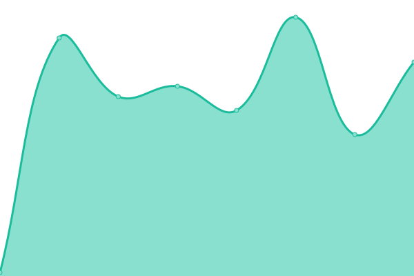
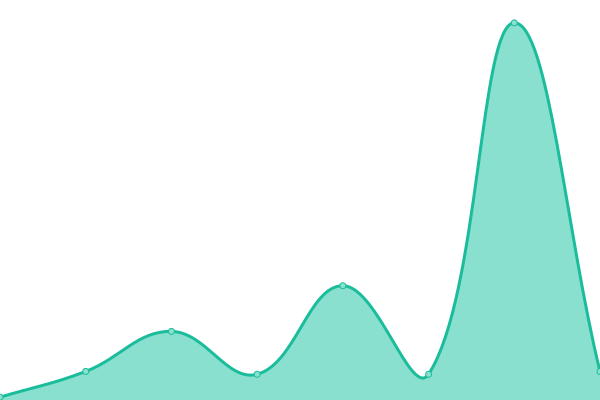
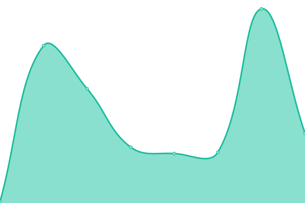

# [📈 Live Status](https://status.24eme.fr/): <!--live status--> **🟩 All systems operational**

Monitorisation des sites, services et applications web administrées par le 24ème

<!--start: status pages-->
<!-- This summary is generated by Upptime (https://github.com/upptime/upptime) -->
<!-- Do not edit this manually, your changes will be overwritten -->
<!-- prettier-ignore -->
| URL | Status | History | Response Time | Uptime |
| --- | ------ | ------- | ------------- | ------ |
|  [declaration.vinsalsace.pro](https://declaration.vinsalsace.pro/statuts/civa.php) | 🟩 Up | [declaration-vinsalsace-pro.yml](https://github.com/24eme/upptime/commits/HEAD/history/declaration-vinsalsace-pro.yml) | 

 617ms
     
 | 

<a href="https://status.24eme.fr/history/declaration-vinsalsace-pro">100.00%</a>
    

|  [login.vinsalsace.pro](https://login.vinsalsace.pro/) | 🟩 Up | [login-vinsalsace-pro.yml](https://github.com/24eme/upptime/commits/HEAD/history/login-vinsalsace-pro.yml) | 

 816ms
     
 | 

<a href="https://status.24eme.fr/history/login-vinsalsace-pro">100.00%</a>
    

|  [declaration.declarvins.net](https://declaration.declarvins.net/contact) | 🟩 Up | [declaration-declarvins-net.yml](https://github.com/24eme/upptime/commits/HEAD/history/declaration-declarvins-net.yml) | 

 586ms
     
 | 

<a href="https://status.24eme.fr/history/declaration-declarvins-net">100.00%</a>
    

|  [login.declarvins.net](https://login.declarvins.net/) | 🟩 Up | [login-declarvins-net.yml](https://github.com/24eme/upptime/commits/HEAD/history/login-declarvins-net.yml) | 

 770ms
     
 | 

<a href="https://status.24eme.fr/history/login-declarvins-net">100.00%</a>
    

|  [declaration.ivbdpro.fr](https://declaration.ivbdpro.fr/statuts/ivbd.php) | 🟩 Up | [declaration-ivbdpro-fr.yml](https://github.com/24eme/upptime/commits/HEAD/history/declaration-ivbdpro-fr.yml) | 

 1070ms
     
 | 

<a href="https://status.24eme.fr/history/declaration-ivbdpro-fr">100.00%</a>
    

|  [login.ivbdpro.fr](https://login.ivbdpro.fr/) | 🟩 Up | [login-ivbdpro-fr.yml](https://github.com/24eme/upptime/commits/HEAD/history/login-ivbdpro-fr.yml) | 

 1094ms
     
 | 

<a href="https://status.24eme.fr/history/login-ivbdpro-fr">100.00%</a>
    

|  [declaration.ivsopro.com](https://declaration.ivsopro.com/statuts/ivso.php) | 🟩 Up | [declaration-ivsopro-com.yml](https://github.com/24eme/upptime/commits/HEAD/history/declaration-ivsopro-com.yml) | 

 1022ms
     
 | 

<a href="https://status.24eme.fr/history/declaration-ivsopro-com">100.00%</a>
    

|  [login.ivsopro.com](https://login.ivsopro.com/) | 🟩 Up | [login-ivsopro-com.yml](https://github.com/24eme/upptime/commits/HEAD/history/login-ivsopro-com.yml) | 

 1047ms
     
 | 

<a href="https://status.24eme.fr/history/login-ivsopro-com">100.00%</a>
    

|  [documentation.ivsopro.com](https://documentation.ivsopro.com/status.php) | 🟩 Up | [documentation-ivsopro-com.yml](https://github.com/24eme/upptime/commits/HEAD/history/documentation-ivsopro-com.yml) | 

 538ms
     
 | 

<a href="https://status.24eme.fr/history/documentation-ivsopro-com">100.00%</a>
    

|  [declaration.vins-centre-loire.com](https://declaration.vins-centre-loire.com/statuts/bivc.php) | 🟩 Up | [declaration-vins-centre-loire-com.yml](https://github.com/24eme/upptime/commits/HEAD/history/declaration-vins-centre-loire-com.yml) | 

 709ms
     
 | 

<a href="https://status.24eme.fr/history/declaration-vins-centre-loire-com">99.80%</a>
    

|  [login.vins-centre-loire.com](https://login.vins-centre-loire.com/) | 🟩 Up | [login-vins-centre-loire-com.yml](https://github.com/24eme/upptime/commits/HEAD/history/login-vins-centre-loire-com.yml) | 

 1633ms
     
 | 

<a href="https://status.24eme.fr/history/login-vins-centre-loire-com">99.74%</a>
    

|  [autodiagnostic.vins-centre-loire.com](https://autodiagnostic.vins-centre-loire.com/) | 🟩 Up | [autodiagnostic-vins-centre-loire-com.yml](https://github.com/24eme/upptime/commits/HEAD/history/autodiagnostic-vins-centre-loire-com.yml) | 

 844ms
     
 | 

<a href="https://status.24eme.fr/history/autodiagnostic-vins-centre-loire-com">100.00%</a>
    

|  [declaration.ava-aoc.fr](https://declaration.ava-aoc.fr/statuts/ava.php) | 🟩 Up | [declaration-ava-aoc-fr.yml](https://github.com/24eme/upptime/commits/HEAD/history/declaration-ava-aoc-fr.yml) | 

 1793ms
     
 | 

<a href="https://status.24eme.fr/history/declaration-ava-aoc-fr">100.00%</a>
    

|  [declaration.syndicat-cotesdurhone.com](https://declaration.syndicat-cotesdurhone.com/statuts/rhone.php) | 🟩 Up | [declaration-syndicat-cotesdurhone-com.yml](https://github.com/24eme/upptime/commits/HEAD/history/declaration-syndicat-cotesdurhone-com.yml) | 

 563ms
     
 | 

<a href="https://status.24eme.fr/history/declaration-syndicat-cotesdurhone-com">100.00%</a>
    

|  [login.syndicat-cotesdurhone.com](https://login.syndicat-cotesdurhone.com/) | 🟩 Up | [login-syndicat-cotesdurhone-com.yml](https://github.com/24eme/upptime/commits/HEAD/history/login-syndicat-cotesdurhone-com.yml) | 

 820ms
     
 | 

<a href="https://status.24eme.fr/history/login-syndicat-cotesdurhone-com">100.00%</a>
    

|  [declaration.syndicat-cotesdeprovence.com](https://declaration.syndicat-cotesdeprovence.com/statuts/provence.php) | 🟩 Up | [declaration-syndicat-cotesdeprovence-com.yml](https://github.com/24eme/upptime/commits/HEAD/history/declaration-syndicat-cotesdeprovence-com.yml) | 

 1051ms
     
 | 

<a href="https://status.24eme.fr/history/declaration-syndicat-cotesdeprovence-com">100.00%</a>
    

|  [login.syndicat-cotesdeprovence.com](https://login.syndicat-cotesdeprovence.com/) | 🟩 Up | [login-syndicat-cotesdeprovence-com.yml](https://github.com/24eme/upptime/commits/HEAD/history/login-syndicat-cotesdeprovence-com.yml) | 

 1287ms
     
 | 

<a href="https://status.24eme.fr/history/login-syndicat-cotesdeprovence-com">100.00%</a>
    

|  [igp.vins.24eme.fr](https://igp.vins.24eme.fr/) | 🟩 Up | [igp-vins-24eme-fr.yml](https://github.com/24eme/upptime/commits/HEAD/history/igp-vins-24eme-fr.yml) | 

 674ms
     
 | 

<a href="https://status.24eme.fr/history/igp-vins-24eme-fr">100.00%</a>
    

|  [login.igp.vins.24eme.fr](https://login.igp.vins.24eme.fr/) | 🟩 Up | [login-igp-vins-24eme-fr.yml](https://github.com/24eme/upptime/commits/HEAD/history/login-igp-vins-24eme-fr.yml) | 

 1007ms
     
 | 

<a href="https://status.24eme.fr/history/login-igp-vins-24eme-fr">100.00%</a>
    

|  [13.igp.vins.24eme.fr](https://13.igp.vins.24eme.fr/statuts/) | 🟩 Up | [13-igp-vins-24eme-fr.yml](https://github.com/24eme/upptime/commits/HEAD/history/13-igp-vins-24eme-fr.yml) | 

 746ms
     
 | 

<a href="https://status.24eme.fr/history/13-igp-vins-24eme-fr">100.00%</a>
    

|  [arles.igp.vins.24eme.fr](https://arles.igp.vins.24eme.fr/statuts/) | 🟩 Up | [arles-igp-vins-24eme-fr.yml](https://github.com/24eme/upptime/commits/HEAD/history/arles-igp-vins-24eme-fr.yml) | 

 681ms
     
 | 

<a href="https://status.24eme.fr/history/arles-igp-vins-24eme-fr">100.00%</a>
    

|  [ardeche.igp.vins.24eme.fr](https://ardeche.igp.vins.24eme.fr/statuts/) | 🟩 Up | [ardeche-igp-vins-24eme-fr.yml](https://github.com/24eme/upptime/commits/HEAD/history/ardeche-igp-vins-24eme-fr.yml) | 

 692ms
     
 | 

<a href="https://status.24eme.fr/history/ardeche-igp-vins-24eme-fr">100.00%</a>
    

|  [drome.igp.vins.24eme.fr](https://drome.igp.vins.24eme.fr/statuts/) | 🟩 Up | [drome-igp-vins-24eme-fr.yml](https://github.com/24eme/upptime/commits/HEAD/history/drome-igp-vins-24eme-fr.yml) | 

 564ms
     
 | 

<a href="https://status.24eme.fr/history/drome-igp-vins-24eme-fr">100.00%</a>
    

|  [gascogne.igp.vins.24eme.fr](https://gascogne.igp.vins.24eme.fr/statuts/) | 🟩 Up | [gascogne-igp-vins-24eme-fr.yml](https://github.com/24eme/upptime/commits/HEAD/history/gascogne-igp-vins-24eme-fr.yml) | 

 582ms
     
 | 

<a href="https://status.24eme.fr/history/gascogne-igp-vins-24eme-fr">100.00%</a>
    

|  [loire.igp.vins.24eme.fr](https://loire.igp.vins.24eme.fr/statuts/) | 🟩 Up | [loire-igp-vins-24eme-fr.yml](https://github.com/24eme/upptime/commits/HEAD/history/loire-igp-vins-24eme-fr.yml) | 

 642ms
     
 | 

<a href="https://status.24eme.fr/history/loire-igp-vins-24eme-fr">100.00%</a>
    

|  [med.igp.vins.24eme.fr](https://med.igp.vins.24eme.fr/statuts/) | 🟩 Up | [med-igp-vins-24eme-fr.yml](https://github.com/24eme/upptime/commits/HEAD/history/med-igp-vins-24eme-fr.yml) | 

 593ms
     
 | 

<a href="https://status.24eme.fr/history/med-igp-vins-24eme-fr">100.00%</a>
    

|  [var.igp.vins.24eme.fr](https://var.igp.vins.24eme.fr/statuts/) | 🟩 Up | [var-igp-vins-24eme-fr.yml](https://github.com/24eme/upptime/commits/HEAD/history/var-igp-vins-24eme-fr.yml) | 

 592ms
     
 | 

<a href="https://status.24eme.fr/history/var-igp-vins-24eme-fr">100.00%</a>
    

|  [vaucluse.igp.vins.24eme.fr](https://vaucluse.igp.vins.24eme.fr/statuts/) | 🟩 Up | [vaucluse-igp-vins-24eme-fr.yml](https://github.com/24eme/upptime/commits/HEAD/history/vaucluse-igp-vins-24eme-fr.yml) | 

 530ms
     
 | 

<a href="https://status.24eme.fr/history/vaucluse-igp-vins-24eme-fr">100.00%</a>
    

|  [declaration.aoc-ventoux.com](https://declaration.aoc-ventoux.com/statuts/ventoux.php) | 🟩 Up | [declaration-aoc-ventoux-com.yml](https://github.com/24eme/upptime/commits/HEAD/history/declaration-aoc-ventoux-com.yml) | 

 731ms
     
 | 

<a href="https://status.24eme.fr/history/declaration-aoc-ventoux-com">100.00%</a>
    

|  [login.aoc-ventoux.com](https://login.aoc-ventoux.com/) | 🟩 Up | [login-aoc-ventoux-com.yml](https://github.com/24eme/upptime/commits/HEAD/history/login-aoc-ventoux-com.yml) | 

 1025ms
     
 | 

<a href="https://status.24eme.fr/history/login-aoc-ventoux-com">100.00%</a>
    

|  [www.aoc-centre-loire.fr](https://www.aoc-centre-loire.fr/) | 🟩 Up | [www-aoc-centre-loire-fr.yml](https://github.com/24eme/upptime/commits/HEAD/history/www-aoc-centre-loire-fr.yml) | 

 580ms
     
 | 

<a href="https://status.24eme.fr/history/www-aoc-centre-loire-fr">100.00%</a>
    

|  [odg.aoc-centre-loire.fr](https://odg.aoc-centre-loire.fr/statuts/) | 🟩 Up | [odg-aoc-centre-loire-fr.yml](https://github.com/24eme/upptime/commits/HEAD/history/odg-aoc-centre-loire-fr.yml) | 

 527ms
     
 | 

<a href="https://status.24eme.fr/history/odg-aoc-centre-loire-fr">100.00%</a>
    

|  [sancerre.aoc-centre-loire.fr](https://sancerre.aoc-centre-loire.fr/statuts/) | 🟩 Up | [sancerre-aoc-centre-loire-fr.yml](https://github.com/24eme/upptime/commits/HEAD/history/sancerre-aoc-centre-loire-fr.yml) | 

 520ms
     
 | 

<a href="https://status.24eme.fr/history/sancerre-aoc-centre-loire-fr">100.00%</a>
    

|  [menetousalon.aoc-centre-loire.fr](https://menetousalon.aoc-centre-loire.fr/statuts/) | 🟩 Up | [menetousalon-aoc-centre-loire-fr.yml](https://github.com/24eme/upptime/commits/HEAD/history/menetousalon-aoc-centre-loire-fr.yml) | 

 519ms
     
 | 

<a href="https://status.24eme.fr/history/menetousalon-aoc-centre-loire-fr">100.00%</a>
    

|  [pouilly.aoc-centre-loire.fr](https://pouilly.aoc-centre-loire.fr/statuts/) | 🟩 Up | [pouilly-aoc-centre-loire-fr.yml](https://github.com/24eme/upptime/commits/HEAD/history/pouilly-aoc-centre-loire-fr.yml) | 

 540ms
     
 | 

<a href="https://status.24eme.fr/history/pouilly-aoc-centre-loire-fr">100.00%</a>
    

|  [quincy.aoc-centre-loire.fr](https://quincy.aoc-centre-loire.fr/statuts/) | 🟩 Up | [quincy-aoc-centre-loire-fr.yml](https://github.com/24eme/upptime/commits/HEAD/history/quincy-aoc-centre-loire-fr.yml) | 

 494ms
     
 | 

<a href="https://status.24eme.fr/history/quincy-aoc-centre-loire-fr">100.00%</a>
    

|  [reuilly.aoc-centre-loire.fr](https://reuilly.aoc-centre-loire.fr/statuts/) | 🟩 Up | [reuilly-aoc-centre-loire-fr.yml](https://github.com/24eme/upptime/commits/HEAD/history/reuilly-aoc-centre-loire-fr.yml) | 

 504ms
     
 | 

<a href="https://status.24eme.fr/history/reuilly-aoc-centre-loire-fr">100.00%</a>
    

|  [giennois.aoc-centre-loire.fr](https://giennois.aoc-centre-loire.fr/statuts/) | 🟩 Up | [giennois-aoc-centre-loire-fr.yml](https://github.com/24eme/upptime/commits/HEAD/history/giennois-aoc-centre-loire-fr.yml) | 

 511ms
     
 | 

<a href="https://status.24eme.fr/history/giennois-aoc-centre-loire-fr">100.00%</a>
    

|  [chateaumeillant.aoc-centre-loire.fr](https://chateaumeillant.aoc-centre-loire.fr/statuts/) | 🟩 Up | [chateaumeillant-aoc-centre-loire-fr.yml](https://github.com/24eme/upptime/commits/HEAD/history/chateaumeillant-aoc-centre-loire-fr.yml) | 

 500ms
     
 | 

<a href="https://status.24eme.fr/history/chateaumeillant-aoc-centre-loire-fr">100.00%</a>
    

|  [oivc.aoc-centre-loire.fr](https://oivc.aoc-centre-loire.fr/statuts/) | 🟩 Up | [oivc-aoc-centre-loire-fr.yml](https://github.com/24eme/upptime/commits/HEAD/history/oivc-aoc-centre-loire-fr.yml) | 

 493ms
     
 | 

<a href="https://status.24eme.fr/history/oivc-aoc-centre-loire-fr">100.00%</a>
    

|  [login.aoc-centre-loire.fr](https://login.aoc-centre-loire.fr/) | 🟩 Up | [login-aoc-centre-loire-fr.yml](https://github.com/24eme/upptime/commits/HEAD/history/login-aoc-centre-loire-fr.yml) | 

 904ms
     
 | 

<a href="https://status.24eme.fr/history/login-aoc-centre-loire-fr">100.00%</a>
    

|  [declaration.vinsdenantes.com](https://declaration.vinsdenantes.com/statuts/) | 🟩 Up | [declaration-vinsdenantes-com.yml](https://github.com/24eme/upptime/commits/HEAD/history/declaration-vinsdenantes-com.yml) | 

 975ms
     
 | 

<a href="https://status.24eme.fr/history/declaration-vinsdenantes-com">100.00%</a>
    

|  [assvas.vins.24eme.fr](https://assvas.vins.24eme.fr/statuts/assvas.php) | 🟩 Up | [assvas-vins-24eme-fr.yml](https://github.com/24eme/upptime/commits/HEAD/history/assvas-vins-24eme-fr.yml) | 

 1001ms
     
 | 

<a href="https://status.24eme.fr/history/assvas-vins-24eme-fr">100.00%</a>
    

|  [juricaf.org](https://juricaf.org/) | 🟩 Up | [juricaf-org.yml](https://github.com/24eme/upptime/commits/HEAD/history/juricaf-org.yml) | 

 776ms
     
 | 

<a href="https://status.24eme.fr/history/juricaf-org">99.91%</a>
    

|  [aurouze.24eme.fr](https://aurouze.24eme.fr/configuration/public/status) | 🟩 Up | [aurouze-24eme-fr.yml](https://github.com/24eme/upptime/commits/HEAD/history/aurouze-24eme-fr.yml) | 

 540ms
     
 | 

<a href="https://status.24eme.fr/history/aurouze-24eme-fr">100.00%</a>
    

|  [tuenet.24eme.fr](https://tuenet.24eme.fr/configuration/public/status) | 🟩 Up | [tuenet-24eme-fr.yml](https://github.com/24eme/upptime/commits/HEAD/history/tuenet-24eme-fr.yml) | 

 745ms
     
 | 

<a href="https://status.24eme.fr/history/tuenet-24eme-fr">100.00%</a>
    

|  [ahrb.24eme.fr](https://ahrb.24eme.fr/configuration/public/status) | 🟩 Up | [ahrb-24eme-fr.yml](https://github.com/24eme/upptime/commits/HEAD/history/ahrb-24eme-fr.yml) | 

 699ms
     
 | 

<a href="https://status.24eme.fr/history/ahrb-24eme-fr">100.00%</a>
    

|  [aurouzetouraine.24eme.fr](https://aurouzetouraine.24eme.fr/configuration/public/status) | 🟩 Up | [aurouzetouraine-24eme-fr.yml](https://github.com/24eme/upptime/commits/HEAD/history/aurouzetouraine-24eme-fr.yml) | 

 681ms
     
 | 

<a href="https://status.24eme.fr/history/aurouzetouraine-24eme-fr">100.00%</a>
    

|  [www.nathanmode-crm.com](https://www.nathanmode-crm.com/status) | 🟩 Up | [www-nathanmode-crm-com.yml](https://github.com/24eme/upptime/commits/HEAD/history/www-nathanmode-crm-com.yml) | 

 710ms
     
 | 

<a href="https://status.24eme.fr/history/www-nathanmode-crm-com">100.00%</a>
    

|  [plateforme.plateau-urbain.com](https://plateforme.plateau-urbain.com/) | 🟩 Up | [plateforme-plateau-urbain-com.yml](https://github.com/24eme/upptime/commits/HEAD/history/plateforme-plateau-urbain-com.yml) | 

 836ms
     
 | 

<a href="https://status.24eme.fr/history/plateforme-plateau-urbain-com">99.97%</a>
    

|  [amvm.24eme.fr/amvm](https://amvm.24eme.fr/amvm/) | 🟩 Up | [amvm-24eme-fr-amvm.yml](https://github.com/24eme/upptime/commits/HEAD/history/amvm-24eme-fr-amvm.yml) | 

 1191ms
     
 | 

<a href="https://status.24eme.fr/history/amvm-24eme-fr-amvm">100.00%</a>
    

|  [amvm.24eme.fr/nextcloud](https://amvm.24eme.fr/nextcloud/status.php) | 🟩 Up | [amvm-24eme-fr-nextcloud.yml](https://github.com/24eme/upptime/commits/HEAD/history/amvm-24eme-fr-nextcloud.yml) | 

 128ms
     
 | 

<a href="https://status.24eme.fr/history/amvm-24eme-fr-nextcloud">100.00%</a>
    

|  [nutri.vin](https://nutri.vin/faq) | 🟩 Up | [nutri-vin.yml](https://github.com/24eme/upptime/commits/HEAD/history/nutri-vin.yml) | 

 788ms
     
 | 

<a href="https://status.24eme.fr/history/nutri-vin">100.00%</a>
    

|  [qr-so.fr](https://qr-so.fr/faq) | 🟩 Up | [qr-so-fr.yml](https://github.com/24eme/upptime/commits/HEAD/history/qr-so-fr.yml) | 

 793ms
     
 | 

<a href="https://status.24eme.fr/history/qr-so-fr">100.00%</a>
    

|  [viticonnect.net](https://viticonnect.net/) | 🟩 Up | [viticonnect-net.yml](https://github.com/24eme/upptime/commits/HEAD/history/viticonnect-net.yml) | 

 648ms
     
 | 

<a href="https://status.24eme.fr/history/viticonnect-net">100.00%</a>
    

|  [cniv.24eme.fr](https://cniv.24eme.fr/status/) | 🟩 Up | [cniv-24eme-fr.yml](https://github.com/24eme/upptime/commits/HEAD/history/cniv-24eme-fr.yml) | 

 689ms
     
 | 

<a href="https://status.24eme.fr/history/cniv-24eme-fr">100.00%</a>
    

|  [www.opendatawine.fr](http://www.opendatawine.fr/) | 🟩 Up | [www-opendatawine-fr.yml](https://github.com/24eme/upptime/commits/HEAD/history/www-opendatawine-fr.yml) | 

 304ms
     
 | 

<a href="https://status.24eme.fr/history/www-opendatawine-fr">100.00%</a>
    

|  [io.24eme.fr/liberatinao/](https://io.24eme.fr/liberatinao/) | 🟩 Up | [io-24eme-fr-liberatinao.yml](https://github.com/24eme/upptime/commits/HEAD/history/io-24eme-fr-liberatinao.yml) | 

 681ms
     
 | 

<a href="https://status.24eme.fr/history/io-24eme-fr-liberatinao">100.00%</a>
    

|  [sergio.24eme.fr](https://sergio.24eme.fr/) | 🟩 Up | [sergio-24eme-fr.yml](https://github.com/24eme/upptime/commits/HEAD/history/sergio-24eme-fr.yml) | 

 197ms
     
 | 

<a href="https://status.24eme.fr/history/sergio-24eme-fr">100.00%</a>
    

|  [brigitte.24eme.fr](https://brigitte.24eme.fr/) | 🟩 Up | [brigitte-24eme-fr.yml](https://github.com/24eme/upptime/commits/HEAD/history/brigitte-24eme-fr.yml) | 

 399ms
     
 | 

<a href="https://status.24eme.fr/history/brigitte-24eme-fr">99.44%</a>
    

|  [jeancloude.24eme.fr](https://jeancloude.24eme.fr/status.php) | 🟩 Up | [jeancloude-24eme-fr.yml](https://github.com/24eme/upptime/commits/HEAD/history/jeancloude-24eme-fr.yml) | 

 488ms
     
 | 

<a href="https://status.24eme.fr/history/jeancloude-24eme-fr">100.00%</a>
    

|  [pdf.24eme.fr](https://pdf.24eme.fr/) | 🟩 Up | [pdf-24eme-fr.yml](https://github.com/24eme/upptime/commits/HEAD/history/pdf-24eme-fr.yml) | 

 929ms
     
 | 

<a href="https://status.24eme.fr/history/pdf-24eme-fr">100.00%</a>
    

|  [24eme.fr](https://24eme.fr) | 🟩 Up | [24eme-fr.yml](https://github.com/24eme/upptime/commits/HEAD/history/24eme-fr.yml) | 

 1202ms
     
 | 

<a href="https://status.24eme.fr/history/24eme-fr">100.00%</a>
    

<!--end: status pages-->

[**Visit our status website →**](https://24eme.github.io/upptime)

## 📄 License

- Powered by: [Upptime](https://github.com/upptime/upptime)
- Code: [MIT](./LICENSE) © [Anand Chowdhary](https://anandchowdhary.com), supported by [Pabio](https://pabio.com)
- Data in the `./history` directory: [Open Database License](https://opendatacommons.org/licenses/odbl/1-0/)
